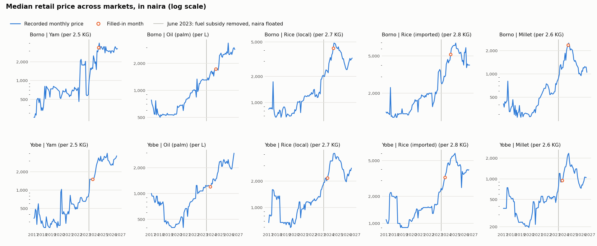
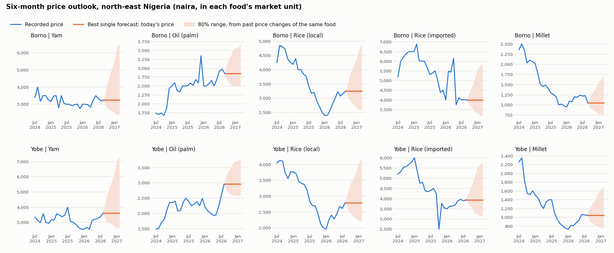

# Can Food Prices in North-East Nigeria Be Forecast Through a Price Shock?

Food prices in Nigeria rose sharply after the fuel subsidy was removed and the naira was floated in mid-2023, then partly fell back in 2025. Aid agencies set the value of food assistance from market prices, so they need to know where prices are heading and how far they might move.

This project tests whether forecasting models predict monthly staple food prices in Borno and Yobe better than simple rules, before, during and after the shock, and whether their prediction ranges can be trusted.

**Result:** none of the models beat the simplest rule.

- Assuming next month's price equals this month's was the most accurate method at 1, 3 and 6 months ahead, for every food. Exponential smoothing and a machine learning model (LightGBM) were reliably worse at several horizons and never better.
- The models failed most during the shock and its reversal. Patterns learned in calm years, such as "prices that run above their average tend to fall back", pointed the wrong way when conditions changed.
- 80% prediction ranges built from past price changes held up in calm years (81 to 84% of real prices fell inside) but covered only 59 to 71% during the shock, missing mostly on the high side, and then missed on the low side when prices fell.
- Ranges built from recent data only, which I expected to adapt faster, did worse, because the recent past pointed the wrong way at the turning point.



## Why this matters

It is tempting to assume a more sophisticated model gives a better forecast. Here, an agency that picked exponential smoothing or machine learning over the simplest rule would have been less accurate, and most wrong during the crisis, when the forecast mattered most. The useful output in this setting is not a better central forecast but an honest range, together with knowledge of when that range stops being reliable.

## Data

- **Source:** World Food Programme market prices for Nigeria, published on the [Humanitarian Data Exchange](https://data.humdata.org/dataset/wfp-food-prices-for-nigeria) under a Creative Commons Attribution for Intergovernmental Organisations licence (CC BY-IGO). Downloaded on 6 October 2026: 89,827 monthly prices, January 2002 to September 2026, 43 products in 68 markets across 14 states.
- **Why Borno and Yobe:** together they hold two thirds of all prices, and they are the only states with records through the shock. Every other state's records end by January 2023, except Adamawa (November 2025).

**From market records to ten price series.** Individual markets report on and off: of 682 market series still active in 2026, half have a gap of 8 months or more, and many markets only started in 2023. So each monthly price is the **median across all markets reporting** that food in that state. A check against the nine longest-running markets found that adding newer markets changed the state price by at most 6% in any year, usually by nothing.

Five staples have nearly complete records in both states:

| Food | Unit | Typical markets per monthly price |
|---|---|---:|
| Yam | 2.5 kg | 10 |
| Palm oil | 1 litre | 10 |
| Local rice | 2.7 kg | 9 to 11 |
| Imported rice | 2.8 kg | 9 |
| Millet | 2.6 kg | 8 to 11 |

The series run from February 2017 to September 2026 in Borno (116 months) and August 2026 in Yobe (115 months).

Data checks and decisions:
- No duplicate prices and no zero or negative prices.
- **2016 was excluded.** It is patchy (gaps of up to 6 months), and January 2016 in Borno has prices three to six times higher than the following months, most likely a unit or entry error.
- **One month per series is filled in** (Borno July 2024, Yobe November 2023), by straight-line interpolation of log prices. Filled-in months are never used to score a forecast.
- **The recording method changed.** Until 2019 every price is flagged `actual`; from 2020 most are `aggregate`, and in 2024 and 2025 all are. I take this to mean a monthly figure computed from several recorded prices, but could not confirm the definition.

**What the data shows:**

| Food | Change, June 2023 to June 2024 | Change, June 2024 to June 2025 | Typical monthly move |
|---|---|---|---:|
| Yam | 2.9 to 3.3 times | 1.1 to 1.2 times | 6.7% |
| Millet | 2.5 to 2.6 times | 0.6 to 0.7 times | 5.4% |
| Local rice | 1.8 to 1.9 times | 0.9 to 1.0 times | 4.0% |
| Imported rice | 1.7 to 1.9 times | 1.0 to 1.3 times | 2.6% |
| Palm oil | 1.1 to 1.4 times | 1.4 to 1.8 times | 3.2% |

Prices also follow the harvest: millet is 5 to 8% below its yearly average from October to January, and yam swings from 12% below average in February to 11% above in August.

## Method

**A fair test (rolling-origin backtest).** Starting in January 2021, I stand at each month in turn, forecast 1, 3 and 6 months ahead using only prices known at that time, compare with the real price, and step forward a month. Models are refitted at every step. This gives 1,925 scored forecasts per method across the three horizons, covering the calm years, the shock year (June 2023 to June 2024) and the period after it.

**Methods compared:**

| Method | Idea |
|---|---|
| Last value | Next price = this month's price |
| Same month last year | Next price = the price 12 months before the target month |
| Average of last 3 | Mean of the last three months |
| Last value + trend | Last value plus the average monthly change of the past year |
| Exponential smoothing (ETS) | Weighted average of the past with a damped trend, with and without a seasonal pattern |
| LightGBM | Gradient-boosted trees trained on all ten series together, predicting the change from today's price from recent changes, volatility, the gap to the 12-month average, the movement of all foods together, the calendar month, food and state |

**Scoring.** Absolute percentage error, scored only against real recorded prices. Differences from "last value" are paired (same series, month and horizon), with 95% confidence intervals from a block bootstrap that resamples whole 6-month stretches (2,000 resamples, seed 42), because errors in neighbouring months are correlated.

## Results

### 1. No method beat "last value"

Average error (%):

| Method | 1 month | 3 months | 6 months |
|---|---:|---:|---:|
| **Last value** | **7.4** | **14.7** | **22.1** |
| Last value + trend | 7.9 | 16.7 | 28.7 |
| ETS, damped trend | 8.3 | 15.8 | 24.0 |
| LightGBM | 9.4 | 16.8 | 24.6 |
| ETS, damped trend + season | 9.6 | 15.9 | 23.7 |
| Average of last 3 | 10.2 | 16.6 | 23.5 |
| Same month last year | 30.4 | 30.4 | 30.7 |

Difference from "last value", in percentage points (positive = worse), with 95% confidence intervals:

| Method | 1 month | 3 months | 6 months |
|---|---|---|---|
| Last value + trend | +0.5 (0.0 to 1.0) | +2.0 (−0.2 to 4.5) | +6.6 (0.3 to 14.0) |
| ETS, damped trend | +0.9 (0.6 to 1.3) | +1.1 (0.4 to 1.8) | +1.9 (0.3 to 3.7) |
| ETS, damped trend + season | +2.2 (1.5 to 2.9) | +1.2 (−0.3 to 2.8) | +1.5 (−0.7 to 4.5) |
| LightGBM | +2.0 (1.4 to 2.7) | +2.1 (0.6 to 3.3) | +2.5 (−0.4 to 4.9) |
| Average of last 3 | +2.8 (2.1 to 3.9) | +1.9 (1.2 to 2.8) | +1.3 (0.4 to 2.2) |
| Same month last year | +23.0 (17.6 to 28.9) | +15.7 (10.0 to 21.6) | +8.6 (3.3 to 13.4) |

Every method is reliably worse one month ahead. At 3 and 6 months, some intervals include zero, so those methods cannot be separated from "last value", but none is better. "Last value" also had the lowest 3-month error for every one of the five foods. Yam was hardest to forecast (21.1%) and palm oil easiest (9.6%).

No method won most individual forecasts: each was closest between 22% and 29% of the time. The trend rule was closest most often (28.7%) yet worse on average, because when it is wrong, at turning points, it is badly wrong.

### 2. The shock is where models fail

3 months ahead, by when the target month falls:

| Method | Error before | Error in shock year | Error after | Bias before | Bias in shock year | Bias after |
|---|---:|---:|---:|---:|---:|---:|
| Last value | 13.9 | 18.2 | 13.8 | −2.7 | −13.9 | +2.1 |
| Last value + trend | 15.7 | 15.9 | 18.0 | +3.8 | −3.7 | +6.7 |
| ETS, damped trend | 15.0 | 18.2 | 15.5 | −1.7 | −13.3 | +5.2 |
| ETS, damped trend + season | 15.8 | 16.7 | 15.6 | −2.5 | −13.8 | +5.8 |
| LightGBM | 14.8 | 21.8 | 16.5 | −2.6 | −18.0 | +4.8 |

*Bias is the average signed error: negative means forecasts were too low.*

- During the shock every method forecast too low, because nothing in past prices anticipated the subsidy removal.
- Following the trend helped during the shock (the trend rule had the lowest error and bias) and hurt afterwards (the highest error, forecasting rises after prices had turned).
- **LightGBM did worst in the shock year.** Its most important features were the 3-month movement of all foods together (17% of importance) and how far a price sat above its 12-month average (14%). From the calm years it learned that prices well above their average tend to fall back; in the shock, prices ran far above their averages and kept rising. It also had little to learn from: about 350 training rows at the first test month.

### 3. Prediction ranges hold in calm times and break at turning points

80% ranges around "last value", built from the past price changes of the same food in both states, using only changes known at the time:

| | 1 month | 3 months | 6 months |
|---|---:|---:|---:|
| Share inside, before the shock | 83.9% | 81.2% | 80.4% |
| Share inside, shock year | 71.2% | 70.4% | 59.2% |
| Share inside, after | 77.7% | 76.2% | 67.3% |
| Missed above, shock year | 20.0% | 25.6% | 36.0% |
| Missed below, after | 14.6% | 16.9% | 25.4% |
| Average width of the range | 24% | 46 to 51% | 64 to 81% |

Ranges built from the **last 24 months only** were worse, not better: three months ahead after the shock they covered 64.2%, with 30.4% of prices below the range, because the recent window was dominated by the shock's rises just as prices turned down.

Three months ahead, coverage was around 90% in 2021, fell to about 70% from mid-2022 to mid-2024, recovered to 83% in early 2025, dropped to 57% in late 2025 as prices fell, and recovered in 2026.

The ranges are wide because these markets are volatile: a three-month 80% range spans roughly half the current price.

### 4. Six-month outlook

From the latest data (September 2026 for Borno, August 2026 for Yobe), with today's price as the best single forecast and an 80% range from all past changes of the same food:



| Series | Latest price | 3 months ahead, 80% range | 6 months ahead, 80% range |
|---|---:|---|---|
| Borno, millet | ₦1,050 | ₦823 to ₦1,399 | ₦740 to ₦1,715 |
| Borno, palm oil | ₦2,850 | ₦2,517 to ₦3,475 | ₦2,502 to ₦3,681 |
| Borno, imported rice | ₦4,000 | ₦3,369 to ₦5,090 | ₦3,198 to ₦5,874 |
| Borno, local rice | ₦3,250 | ₦2,758 to ₦4,131 | ₦2,572 to ₦4,896 |
| Borno, yam | ₦3,250 | ₦2,602 to ₦5,046 | ₦2,413 to ₦6,503 |
| Yobe, millet | ₦1,046 | ₦820 to ₦1,394 | ₦737 to ₦1,708 |
| Yobe, palm oil | ₦2,957 | ₦2,611 to ₦3,605 | ₦2,596 to ₦3,819 |
| Yobe, imported rice | ₦3,937 | ₦3,315 to ₦5,010 | ₦3,147 to ₦5,781 |
| Yobe, local rice | ₦2,793 | ₦2,370 to ₦3,551 | ₦2,211 to ₦4,208 |
| Yobe, yam | ₦3,618 | ₦2,897 to ₦5,618 | ₦2,686 to ₦7,239 |

*Prices are per market unit (see the Data table). Based on the backtest, if markets turn turbulent these ranges should be expected to cover about 60 to 70% of outcomes rather than 80%.*

## Limitations

- **Two states, five foods.** Results describe conflict-affected markets in north-east Nigeria and may not hold elsewhere.
- **One test period with one shock.** The comparison rests on 2021 to 2026, a period dominated by a single policy shock and its reversal.
- **State prices are medians across a changing set of markets.** The composition check found little effect, but it cannot rule it out entirely.
- **The recording method changed** from `actual` to `aggregate` prices around 2020, which may have changed how smooth the series are.
- **No outside information.** The models used past prices only. Exchange rates, fuel prices and rainfall might help; in particular, no model could anticipate a policy announcement.
- **Small data for machine learning**, and model settings were chosen once rather than tuned, so a better-configured model might do better. Tuning on the test period would have been unfair.
- **Percentage error is asymmetric**: a forecast that is too high can be off by more than 100%, one that is too low cannot.
- **The outlook is illustrative, not advice.**

## Future work

- Add outside indicators: the exchange rate, petrol prices (also in the WFP data) and rainfall
- Prediction ranges that widen quickly in turbulent periods without leaning in the direction of the latest trend
- Test the methods on the pre-2023 records of the other twelve states
- Forecast at market level using models that handle missing months directly

## Repository structure

```text
.
├── data/
│   ├── wfp_food_prices_nga_downloaded_2026-10-06.csv   # the exact WFP file used (CC BY-IGO)
│   └── price_panel.csv                                  # the ten monthly series (observed = real price)
├── notebooks/
│   ├── food-01-data-check.ipynb    # download, checks, series selection, cleaning, seasonality
│   └── food-02-forecast.ipynb      # backtest, baselines, ETS, LightGBM, confidence intervals, ranges, outlook
├── results/
│   ├── price_series.png
│   ├── forecasts.csv               # every backtest forecast and its error
│   ├── vs_last_value.csv           # differences from "last value" with confidence intervals
│   ├── prediction_ranges.csv       # every backtest range and whether the real price fell inside
│   ├── price_outlook.csv
│   └── price_outlook.png
└── README.md
```

## Reproducing

The notebooks run on Kaggle without a GPU. Notebook 01 downloads the latest data from HDX, which will include months after September 2026; to reproduce these exact results, read `data/wfp_food_prices_nga_downloaded_2026-10-06.csv` instead.

## References

- World Food Programme (2026). *Nigeria – Food Prices*. Humanitarian Data Exchange. CC BY-IGO.
- Hyndman, R. J. & Athanasopoulos, G. (2021). *Forecasting: Principles and Practice*, 3rd edition. OTexts.
- Ke, G. et al. (2017). LightGBM: A Highly Efficient Gradient Boosting Decision Tree. *NeurIPS*.
- Künsch, H. R. (1989). The jackknife and the bootstrap for general stationary observations. *Annals of Statistics*, 17(3).

## Author

Chinecherem Divine Mbah · [GitHub](https://github.com/Chichay317)
